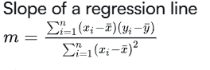

Given the test scores of 10 students in Physics and History, compute the slope of the regression line obtained by treating Physics as the independent variable. The result should be rounded to three decimal places.

The scores to use:

Physics Scores  15  12  8   8   7   7   7   6   5   3
History Scores  10  25  17  11  13  17  20  13  9   15
Slope of a regression line

Where:

m is the slope of the regression line,
x and y are the data points,
x and y are the means of the -values and -values, respectively,
n is the number of data points.
Output Format

In the text box, enter the floating point/decimal value required. Do not leave any leading or trailing spaces. Your answer may look like: 0.255

This is NOT the actual answer - just the format in which you should provide your answer.